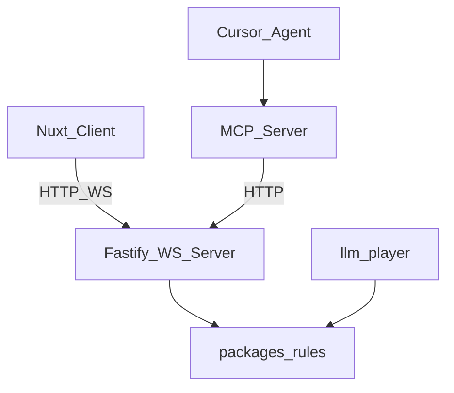

# Architecture

## Principles

1. **Authoritative server** — clients and MCP never mutate state directly
2. **Shared rules** — `@galaxy/rules` for validation and observation
3. **Geometry-first observation** — ASCII map + spatial summary for LLM strategy
4. **MCP for external agents** — internal LLM player uses rules directly

See [Galaxy Andromeda App plan](../.cursor/plans/) for full game design.
