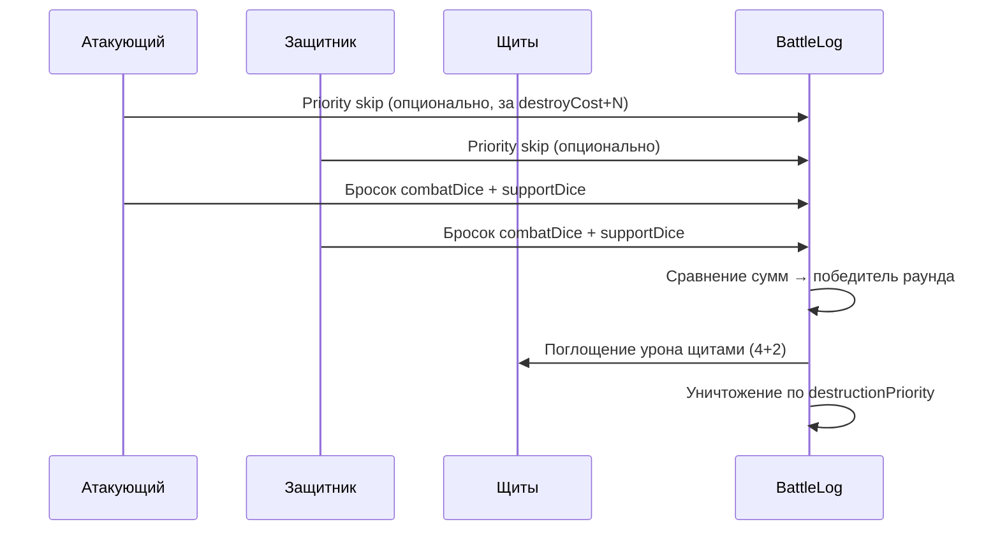

# Боевая система Galaxy Andromeda — черновик

> Статус: **MVP реализован** в `@galaxy/rules/src/combat.ts`, интеграция в `movement.ts` / `bombardment.ts`, UI `BattleModal`.
> Источники: [rulebook.md](./rulebook.md) § «Combat and bombardment», [ships.yaml](../packages/rules/data/ships.yaml).

## 1. Когда начинается бой

### 1.1. Триггеры (по rulebook и текущему движению)

| Триггер | Описание | MVP | Позже |
|--------|----------|-----|-------|
| **Вход в оспариваемую клетку** | Корабль перемещается на гекс, где уже есть **вражеские корабли** и/или **контроль другого игрока** | ✅ | — |
| **Столкновение после хода** | Несколько игроков переместили корабли в одну клетку в рамках фазы «Действия» | частично (детект) | полная очередь |
| **Обстрел (bombardment)** | Крейсер / линкор / Г.О. бьют по **соседнему** или **дальнему** гексу (`fireRange` в yaml) | ✅ | — |
| **Соседний бой без входа** | Бой «через грань» без совмещения стеков | — | уточнить по PDF |

**Текущий код движения** (`movement.ts`) блокирует ход на вражескую клетку сообщением «Вражеская клетка — бой пока не реализован». В MVP боя:

1. UI **показывает превью** боя при выборе такой клетки.
2. Сервер/rules **разрешают** ход с постановкой `pendingCombats[]`.
3. Бой **разрешается** сразу после применения перемещения (или в подфазе «бой» до снятия маркера).

**Оспариваемая клетка** (`isCombatDestination`):

- `controlOwnerId !== null && controlOwnerId !== атакующий`, **или**
- на клетке есть корабли другого игрока.

Нейтральная клетка **без** вражеских кораблей — не бой (только захват снабжением).

### 1.2. Пример из rulebook

> Round: **priority skip → dice → winner → destruction by priority tiers**.

Один **раунд** боя — последовательность шагов; при ничьей по кубикам возможны повторные раунды (TODO: уточнить по PDF).

---

## 2. Порядок разрешения боя

### 2.1. Фазы раунда



### 2.2. Priority skip (пропуск приоритета уничтожения)

**До броска кубов** (только текущий раунд) любой участник боя может объявить skip для **типа корабля противника** (`ShipType`), а не для отдельного экземпляра. Skip только **префиксом** `destructionPriority` среди типов врага в бою; последний присутствующий тип пропускать нельзя (бессмысленно). Объявление **бесплатное** — без оплаты фишками. Если объявивший побеждает, пропущенные типы получают +1 к `destroyCost` и их можно обойти при выборе уничтожения (открывается следующий tier).

```yaml
# ships.yaml
battleship:
  destroyCost: 9
destructionPriority:
  - destroyer   # уничтожаются первыми
  - hyper
  - shield
  - cruiser
  - battleship  # линкор — поздний tier
  - supply
```

**Реализация:** `CombatPrioritySkipPlan.shipType`, `validateCombatOptions`, чекбоксы по типам в `BattleModal` для обеих сторон; `immediatelyDestroyableIds` подсвечивает цели первого доступного tier в UI.

### 2.3. Кубики

| Класс | combatDice | supportDice | fireRange |
|-------|------------|-------------|-----------|
| Эсминец | 1 | — | — |
| Крейсер | 2 | 1 | 1 |
| Линкор | 3 | 2 | 2 |
| Щитоносец | — | — | — |
| Г.О. | — | 3 | 2–3 |
| Снабжение | — | — | — |

- **combatDice** — участвуют в бою на **своей** клетке (гекс боя).
- **supportDice** — поддержка с **дальности** `fireRange` (корабль **не** на гексе боя):
  - Крейсер: +1d6, range 1
  - Линкор: +2d6, range 2
  - Г.О.: +3d6, range 3 (max из `[2,3]` в yaml)
- Щитоносец **не бросает** кубики; даёт поглощение урона.

**Реализация (MVP):** `collectSupportShips` + `rollCombatRound` в `combat.ts`; каждый корабль бросает свои d6 отдельно; UI показывает журнал бросков.

### 2.4. Щиты (shield absorb 4+2)

Из `ships.yaml`:

```yaml
shield:
  shieldAbsorb: { self: 4, neighbor: 2 }
```

**Пример rulebook:** щит на **той же** клетке поглощает **4** очка урона; щит на **соседнем** гексе — **2** очка для защищаемой клетки.

**Черновой алгоритм поглощения:**

1. После определения победителя раунда `rawDamage = computeRoundDamage(round)` — **очки уничтожения** = |сумма атакующего − сумма защитника| (`packages/rules/src/combat.ts`).
2. Сначала `self`-щиты на клетке боя (до 4 на каждый щитоносец).
3. Затем `neighbor`-щиты на face-adjacent гексах (до 2 на щит / цель).
4. Остаток → уничтожение кораблей по `destructionPriority`.

### 2.5. Уничтожение по приоритету

Порядок из `destructionPriority` в yaml. Корабли типов с **объявленным priority skip** уходят в конец очереди своего tier.

**После раунда:** победитель **обязан** потратить очки уничтожения на корабли проигравшего (с учётом щитов и skip). Если урон покрывает весь флот проигравшего — **авто-wipe**. Иначе победитель **вручную** выбирает корабли (`confirm-combat-destruction`, фаза «Уничтожение» в `BattleModal`). Неиспользованные очки сгорают; бюджет не переносится между раундами. `selectShipsToDestroy` не берёт корабль, если `destroyCost` превышает остаток бюджета.

---

## 3. Модель данных

### 3.1. Новые типы (sketch в `combat.ts`)

| Тип | Назначение |
|-----|------------|
| `CombatSide` | `attacker` / `defender` + `playerId` + список `CombatParticipant` |
| `CombatParticipant` | `shipId`, `type`, флаги `destroyed` |
| `CombatPreview` | UI/логика: стороны, порядок уничтожения, оценка щитов, `wouldTriggerCombat` |
| `PendingCombat` | Бой после хода: `coord`, `attackerId`, `defenderId`, `trigger: 'movement' \| 'bombardment'` |
| `BattleLogEntry` | Шаг раунда: skip, броски, поглощение щитом, уничтоженные id |
| `CombatResolutionResult` | Итог: победитель, обновлённые корабли, записи лога |

### 3.2. Изменения `GameSnapshot` (future, ADR)

```typescript
interface GameSnapshot {
  // ...
  pendingCombats?: PendingCombat[]   // очередь после movement marker
  lastBattleLog?: BattleLogEntry[]   // для UI replay
}
```

**MVP:** типы живут в `combat.ts`, в snapshot **не пишем** (breaking-free). Клиент строит `CombatPreview` на лету из текущего `GameSnapshot` + планируемого хода.

### 3.3. Связь с движением

```
executeMarkerMovement
  → apply ship moves
  → detectCombatsFromMoves(game, moves, playerId)
  → для каждой pending: resolveCombatAtCell (TODO)
  → eventLog += battle summary
```

---

## 4. MVP vs Future

### MVP (реализовано)

- [x] Документ и типы в `combat.ts`
- [x] `isCombatDestination`, `detectCombats`, `buildCombatPreview`, **`resolveCombatAtCell` (полное разрешение)**
- [x] `rollCombatRound` — честные per-ship броски + support с fireRange
- [x] `collectSupportShips`, `supportingShips` в превью
- [x] Тесты: shield 4+2, детект оспариваемой клетки, support + per-ship rolls, уничтожение, one battle per marker
- [x] UI: превью боя при выборе contested hex, `BattleModal` с priority skip и анимацией бросков + итог (щиты, уничтожение)
- [x] Одна клетка боя на приказ маркера (`validateSingleCombatDestination`)
- [x] Обстрел MVP: `bombardment.ts`, UI «Обстрел», `execute-marker-bombardment` **с разрешением боя** (защитник не бросает; урон = сумма обстрела; контроль клетки не передаётся)
- [x] Подсказки фазы «Действия» про бой после перемещения
- [x] **Разрешение боя на сервере** — `applyGameActionOnSnapshot` + `lastCombatResult` в observation
- [x] **Ход в contested hex** — бой до перемещения; при победе атакующего корабли входят на клетку
- [x] **Priority skip** — по **типу корабля**, обе стороны; оплата destroyCost + 2; UI чекбоксы в `BattleModal`
- [x] **Щиты** — `applyShieldAbsorption` (self 4, neighbor 2)
- [x] **Очки уничтожения** — `computeRoundDamage` = |атакующий − защитник|
- [x] **Уничтожение** — ручной выбор победителем (`confirm-combat-destruction`); авто-wipe при полном покрытии; `selectShipsToDestroy` по `destructionPriority`
- [x] **Мультираунд (частично)** — `pendingCombat`, `continue-combat` / `stop-combat` для атакующего

### Future

- [ ] Отступление защитника (согласие / retreat на соседнюю свободную клетку; PDF)
- [ ] Полный retreat атакующего на исходную клетку + снятие маркера действия при отступлении
- [ ] Полная интеграция `pendingCombats` в MCP `game_get_state`
- [ ] Анимация replay из сохранённого `BattleLog` между сессиями
- [ ] ADR для изменений `types.ts` / `GameSnapshot` (`pendingCombats`, `lastBattleLog`)

---

## 5. UI/UX — фаза «Действия»

### 5.1. Поток (расширение marker movement)

1. Клик по маркеру → `MarkerActionModal` (выбор кораблей).
2. Выбор клеток на карте (`useMarkerMapPick`).
3. **Новое:** если клетка оспариваемая — подсветка «боевая зона» + **панель превью** (`CombatPreviewPanel`) сбоку от баннера (не блокирует карту).
4. Подтверждение → **mock** `BattleModal`: пошаговые броски d6 per-ship, поддержка с соседних гексов, бегущие суммы.
5. Закрытие модалки → сообщение «полное разрешение боя — в разработке»; движение **не** применяется до готовности rules.

### 5.2. Non-blocking UX

- Баннер перемещения остаётся сверху (как сейчас).
- `CombatPreviewPanel` — компактная карточка под баннером, `pointer-events: auto`.
- `BattleModal` — единственный полноэкранный overlay **по намерению** (осознанный просмотр итога боя).

### 5.3. Тексты (RU)

- Hero: «После перемещения на вражескую клетку может начаться бой — проверьте превью».
- Превью: «Атакующие / Защитники», «Щит: 4 на клетке, +2 с соседа», «Priority skip — бесплатно по типу корабля».

---

## 6. Ссылки на код

| Область | Файл |
|---------|------|
| Sketch rules | `packages/rules/src/combat.ts` |
| Блокировка вражеских клеток | `packages/rules/src/movement.ts` → `validateDestinationForMove` |
| UI pick | `packages/client/composables/useMarkerMapPick.ts` |
| Превью / модалка | `CombatPreviewPanel.vue`, `BattleModal.vue` |
| Подсказки | `packages/client/utils/game-help.ts` |
